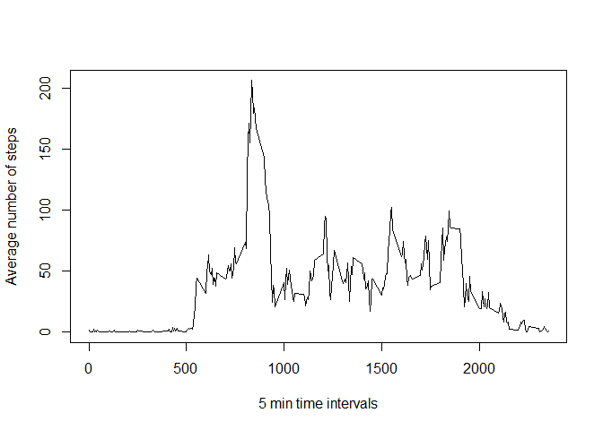

# PA1_template
Ewa Nowacka  
October 19, 2016  

This document shows the analysis of data from a personal activity monitoring device. This device collects data at 5 minute intervals through out the day. The data consists of two months of data from an anonymous individual collected during the months of October and November, 2012 and include the number of steps taken in 5 minute intervals each day.

The variables included in this dataset are:  
* **steps**: Number of steps taking in a 5-minute interval (missing values are coded as NA)  
* **date**: The date on which the measurement was taken in YYYY-MM-DD format  
* **interval**: Identifier for the 5-minute interval in which measurement was taken  

#Loading and preprocessing the data
First, after seting up our working directory, we will load the data which is stored in csv file.

```r
activity<-read.csv(file="activity.csv",header=TRUE,sep=",")
```
Let's take a quick look at our data. First, we will check how few first rows look like using `head()` function.

```r
head(activity)
```

```
##   steps       date interval
## 1    NA 2012-10-01        0
## 2    NA 2012-10-01        5
## 3    NA 2012-10-01       10
## 4    NA 2012-10-01       15
## 5    NA 2012-10-01       20
## 6    NA 2012-10-01       25
```
It would also good to know how our data is distributed. For this purpose we will need `summary()` function.

```r
summary(activity)
```

```
##      steps                date          interval     
##  Min.   :  0.00   2012-10-01:  288   Min.   :   0.0  
##  1st Qu.:  0.00   2012-10-02:  288   1st Qu.: 588.8  
##  Median :  0.00   2012-10-03:  288   Median :1177.5  
##  Mean   : 37.38   2012-10-04:  288   Mean   :1177.5  
##  3rd Qu.: 12.00   2012-10-05:  288   3rd Qu.:1766.2  
##  Max.   :806.00   2012-10-06:  288   Max.   :2355.0  
##  NA's   :2304     (Other)   :15840
```

# What is mean total number of steps taken per day?
That was really cool! So let's now calculate something...Maybe the total number of steps taken per day?

```r
total_steps<-aggregate(steps~date,activity,sum)
head(total_steps)
```

```
##         date steps
## 1 2012-10-02   126
## 2 2012-10-03 11352
## 3 2012-10-04 12116
## 4 2012-10-05 13294
## 5 2012-10-06 15420
## 6 2012-10-07 11015
```
The `aggregate` function is not the only way to do it. There is also famous and very useful `tapply` function. We should obtain the same data set regardless the method we use. Let's quicky check that it is the truth indeed.

```r
total_steps2<-with(activity,tapply(steps,date,FUN=sum))
head(total_steps2)
```

```
## 2012-10-01 2012-10-02 2012-10-03 2012-10-04 2012-10-05 2012-10-06 
##         NA        126      11352      12116      13294      15420
```
As we see the numbers are the same, but the output format is different. `tapply()` function returns matrix/array while `aggregate` returns data frame. Since I personally prefer working with data frames, I will use `aggregate()` function for my analysis.
I would like to know what is the distribution of the total numbers of steps. First, I will take a look at the variable's histogram.

```r
options(width=200)
hist(total_steps$steps,main="Histogram for total number of steps per day",xlab="Total number of steps per day",border="black",col="green")
```

<!-- -->
 
I wonder how the density function for the total number of steps would look like. I will check it with `lines()` funtcion.

```r
options(width=200)
hist(total_steps$steps,main="Histogram for total number of steps per day",prob=TRUE,xlab="Total number of steps per day",border="black",col="green")
lines(density(total_steps$steps))
```

<!-- -->
 
Now let's create a vector called **summary_total** where we will store mean and median of total number of steps.

```r
summary_total<-c(mean(total_steps$steps),median(total_steps$steps))
names(summary_total)<-c("mean","median")
summary_total
```

```
##     mean   median 
## 10766.19 10765.00
```
Hence, the mean of total number of steps per day is 10766.19 and the median is 10765.

# What is the average daily activity pattern?
Now we will analyze the average daily activity pattern.

```r
average_steps<-aggregate(steps~interval,activity,mean,na.rm=TRUE)
plot_avg<-with(average_steps,plot(interval,steps,type="l",xlab="5 min time intervals", ylab="Average number of steps"))
```

<!-- -->

```r
max_val<-max(average_steps$steps)
max_val
```

```
## [1] 206.1698
```

```r
average_steps[which(average_steps$steps==max_val),]
```

```
##     interval    steps
## 104      835 206.1698
```
Hence the above results, the maximum number of steps, which is 206.1698,  we can find in interval 835.  

# Imputing missing values
Now it is time to take care of **missing values**. How many are they and how can we get rid of them?

```r
sum(is.na(activity))
```

```
## [1] 2304
```

```r
activity_noNa<-activity

for (i in 1:nrow(activity_noNa)){
  if(is.na(activity_noNa[i,]$steps)){
    activity_noNa[i,]$steps<-average_steps[which(average_steps$interval==activity_noNa[i,]$interval),]$steps
  }
}
head(activity_noNa)
```

```
##       steps       date interval
## 1 1.7169811 2012-10-01        0
## 2 0.3396226 2012-10-01        5
## 3 0.1320755 2012-10-01       10
## 4 0.1509434 2012-10-01       15
## 5 0.0754717 2012-10-01       20
## 6 2.0943396 2012-10-01       25
```

```r
sum(is.na(activity_noNa))
```

```
## [1] 0
```
It seems that all NA-s have been replaced and the new data set looks reasonable. Now, let's make a histogram of the total number of steps taken each day and calculate and report the mean and median total number of steps taken per day using our new data set.

```r
head(activity_noNa)
```

```
##       steps       date interval
## 1 1.7169811 2012-10-01        0
## 2 0.3396226 2012-10-01        5
## 3 0.1320755 2012-10-01       10
## 4 0.1509434 2012-10-01       15
## 5 0.0754717 2012-10-01       20
## 6 2.0943396 2012-10-01       25
```

```r
total_steps_noNA<-aggregate(steps~date,activity_noNa,sum)
hist(total_steps_noNA$steps,main="Histogram for total number of steps per day",xlab="Total number of steps per day",border="black",col="green")
```

<!-- -->

```r
summary_noNa<-c(mean(total_steps_noNA$steps),median(total_steps_noNA$steps))
names(summary_noNa)<-c("mean","median")
summary_noNa
```

```
##     mean   median 
## 10766.19 10766.19
```
As we see we have obtained different number this time and what is more, the mean and the median are equal.

# Are there differences in activity patterns between weekdays and weekends?

```r
day_type<-function(x)
  {
  if (weekdays(x) %in% c("Saturday","Sunday"))
  {
   return("Weekend")
  }
  else{
    return ("Weekday")
  }
} 
day_type(as.Date("10/12/2016"))
```

```
## [1] "Weekday"
```

```r
activity_noNa$dayT<-sapply(as.Date(activity_noNa$date),function(x) day_type(x))
activity_noNa <- transform(activity_noNa, dayT = as.factor(dayT))
table(activity_noNa$dayT)
```

```
## 
## Weekday Weekend 
##   12960    4608
```
Now,we will make a plot containing a time series plot of the 5-minute interval (x-axis) and the average number of steps taken, averaged across all weekday days or weekend days (y-axis). For this purpose, we will use **lattice** package.

```r
week_data<-aggregate(steps~interval+dayT,activity_noNa,mean)

head(week_data)
```

```
##   interval    dayT      steps
## 1        0 Weekday 2.25115304
## 2        5 Weekday 0.44528302
## 3       10 Weekday 0.17316562
## 4       15 Weekday 0.19790356
## 5       20 Weekday 0.09895178
## 6       25 Weekday 1.59035639
```

```r
week_data <- transform(week_data, dayT = as.factor(dayT))
library(lattice)
attach(week_data)
xyplot(steps~interval|dayT,layout=c(1,2),type="l")
```

<!-- -->
